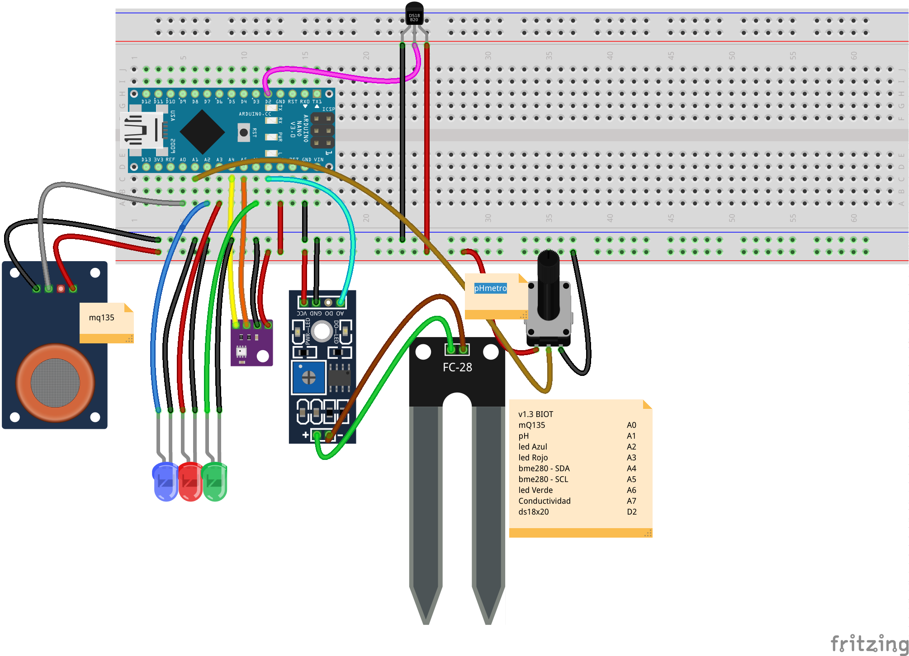

# Biot v1.3

Sistema de monitorización de un sistema biológico

## Montaje

	mQ135		A0
	pH 			A1
	led Azul		A2
	led Rojo		A3
	bme280 - SDA	A4 
	bme280 - SCL	A5
	led Verde		A6
	Conductividad	A7
	ds18x20		D2

### Sensor atomosferico BME280

#### Cambio de address

[Documentacion BME280](https://lastminuteengineers.com/bme280-arduino-tutorial/)

Podemos usar 2 BME280 desde la API de la librer'ia de adafruit [Ejemplo](https://github.com/adafruit/Adafruit_BME280_Library/blob/master/Adafruit_BME280.h#L133) usando begin(address)

## Código

Actualizado el fichero biodata.py a version 1.3
* Soporta 7 dato de presion atmósferica
* Optimizado el repintado para no cargar el sistema a 1 vez por minuto
* Dibujando los 7 valores

Actualizado biot_1.1.ino
* Permite elegir entre el sensor Gy-21 y el bme280 que mide también la presión atmosférica

Añadido calibracion_ph.ino
* Para calibrar el sensor de pH

Actualizado el fichero biodata.py a version 1.2

* Se han agrupado todos los datos que deben ser configurados por el usuario para mayor comodidad.

* (Si ejecutas esta nueva versión recuerda utilizar el comando /start en tu bot para reiniciarlo y poder ver las nuevas opciones en el menu. en cualquier caso, escribiendolas estaran disponibles).
* Añadidos tres nuevos comandos al menu del bot:
  * /txt  envia el fichero de datos como mensaje de telegram.
  * /deleteOld  borra los primeros 15 datos de la serie, de manera que se pueden ir eliminando los datos erroneos de los primeros minutos.
  * /deleteNew  borra los ultimos 15 datos de la serie, de manera que se pueden ir eliminando posibles datos erroneos de los ultimos minutos.
* Se ha suprimido la representacion de dos variables (luz roja y luz azul) ya que no se conectaron y solo mostraban ruido.
* Se han separado las graficas de temperatura y humedad para que se muestren mejor en sus respectivas escalas.
* Modificada la funcion de representacion grafica para que solo represente como maximo 1440 muestras. Es decir las ultimas 24 horas, si se toma una muestra por minuto. Pero la toma de datos si conserva todos y seran enviados cuando se pida el txt o el email
